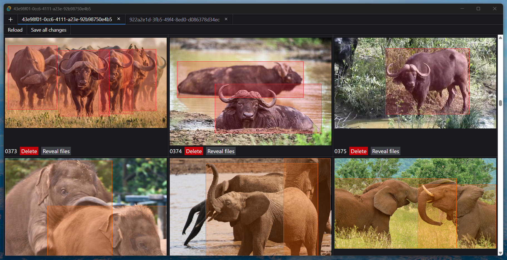
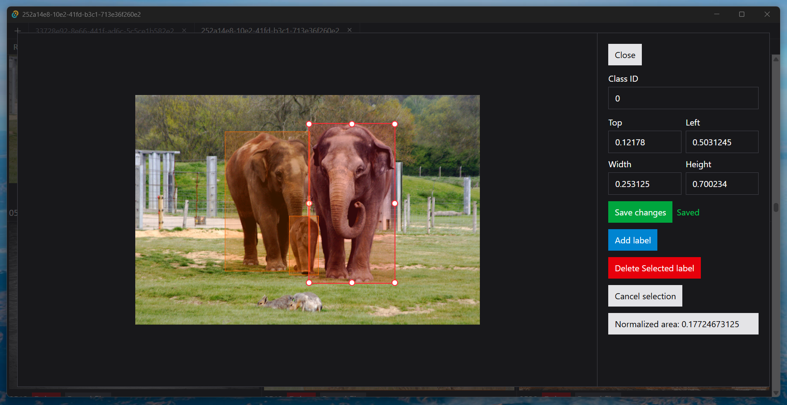

# Dataset GUI

A lightweight desktop application for viewing and editing object detection datasets in YOLO format.

Built with Tauri, SvelteKit, and TypeScript.



## Features

- **Browse datasets** — Load images and labels from separate directories (standard YOLO folder structure)
- **Visual bounding box editing** — Drag and resize bounding boxes directly on images
- **Multi-tab support** — Work with multiple datasets simultaneously
- **Dataset history** — Quickly access recently opened datasets
- **Auto-save** — Changes are automatically saved to label files



## Dataset Format

The application expects YOLO format:

- **Images directory** — Contains image files (`.jpg`, `.png`, etc.)
- **Labels directory** — Contains `.txt` files with the same names as images

Label format (one line per object):
```
<class_id> <x_center> <y_center> <width> <height>
```

All coordinates are normalized (0-1).

## Getting Started

### Prerequisites

- [Node.js](https://nodejs.org/)
- [Rust](https://www.rust-lang.org/tools/install)
- [Tauri prerequisites](https://tauri.app/start/prerequisites/)

### Run

```bash
git clone https://github.com/roman-koshchei/dataset-gui.git
cd dataset-gui
npm install
npm run tauri dev
```

To create an optimized build:

```bash
npm run tauri build
```
